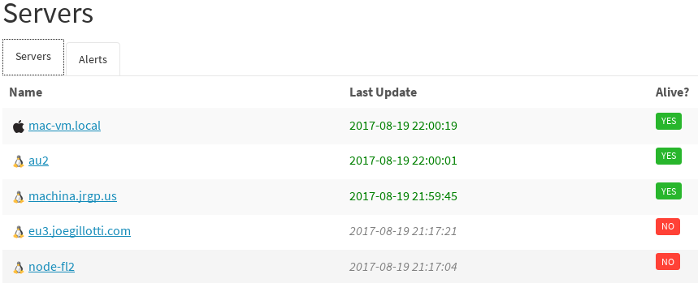

# HealthApp

Open source (MIT) replacement for New Relic's deprecated server health monitoring solution, written in Golang. This will fire alerts and send emails when servers being monitored stop reporting or when their filesystems get too full.

## Features

- Intelligent alert lifecycle and processing. 1) Created 2) Ongoing 3) Closed.
- Alerts created when monitoring servers drop out
- Alerts created when filesystems on monitored servers go above threshold
- Send emails on alerts
- Lightweight with minimal configuration and setup. Only dependency is redis.
- HMAC auth + integrity checking to avoid other people sending you alerts
- Smooth, lightweight single-page-app (SPA) UI, styled with [Bootswatch](https://bootswatch.com/).
- Single-binary deployment, because golang
- Tested on Linux and macOS

## Components

###### API Server

- stateless golang app. you can spin up several behind a balancer.
- listens for updates from server agents
- provides api access to list servers and alerts
- provides web UI (a single page app) which pulls from the API endpoints
  and displays them nicely

###### Alert Processor

- stateful service. only run one of these at once (until i add leader election)
- periodically poll redis for the latest server statuses, and intelligently
  create, maintain, and close alerts as events change
- handles notifications (currently email based) for alert state transitions

###### Agent

- run this on each server that needs to be monitored. periodically POSTs to API Server

###### Redis

- all state (servers, alerts, etc) is stored in redis. If you need this to scale, you can put a proxy in front of a pool of redis servers for durability + sharding.

## Quickstart (for developers)

If you install Go and Glide, after `go get`ing this package and `cd`ing into the folder, you can compile like this:

    glide install
    go build

Copy sample config file. This can be placed in `/etc/healthapp/config.yaml` or any other path specified by `CONFIG_FILE` env var, otherwise `config.yaml` in the current directory.

    cp config.sample.yaml config.yaml

To start API server:

    ./healthapp -serve

To start the alert processor:

    ./healthapp -alerter

To start slave agent:

    ./healthapp -agent

## Prod deployment

If you have [fpm](https://fpm.readthedocs.io/en/latest/index.html) installed, you can build a .deb package using the following. You could even use [quickdebrepo](https://github.com/jrgp/quickdebrepo) to host your own apt repositiory.

    fpm -s dir -t deb -n healthapp -v 0.0.1 --prefix /opt/healthapp healthapp static

Once the resulting deb is installed, HealthApp will be installed to `/opt/healthapp/healthapp` and will accept the arguments as above.

It's recommended you run the API Server behind a reverse proxy, eg apache or nginx, and use that to terminate SSL.

## TODO

- Integrate with [Iris](https://github.com/linkedin/iris/) for notifications, to support others than just email
- UI (CLI or web) for "forgetting" servers which don't exist anymore

## Meta

- MIT licensed
- Open a GitHub issue or email me at joe@u13.net with any questions.
- PRs welcome
